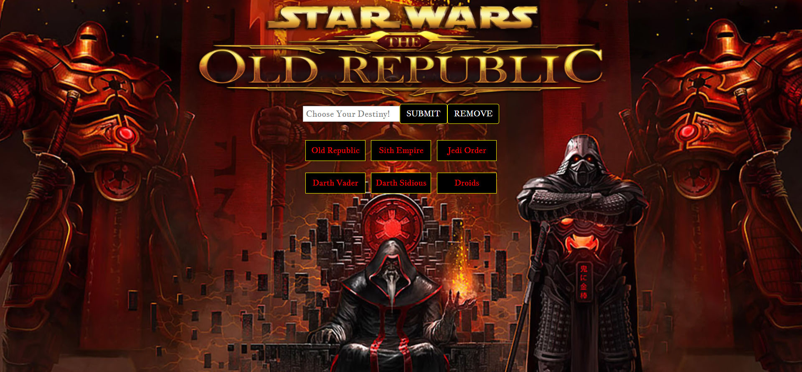
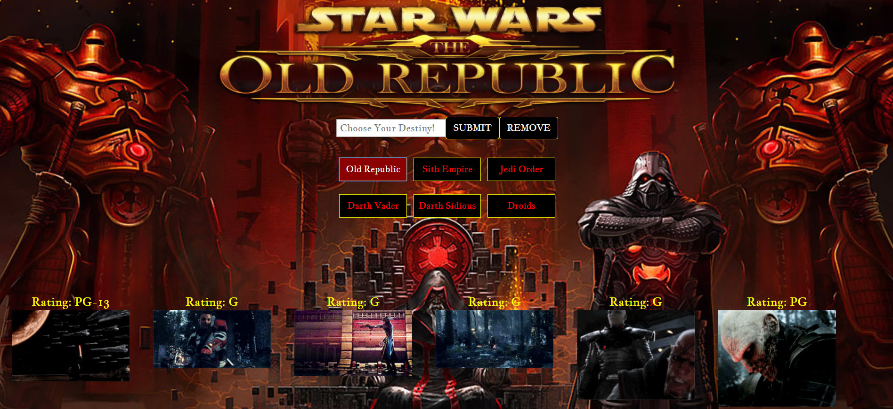
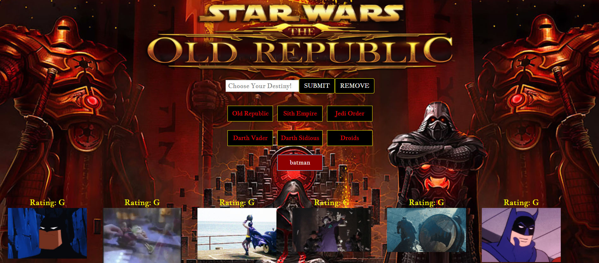
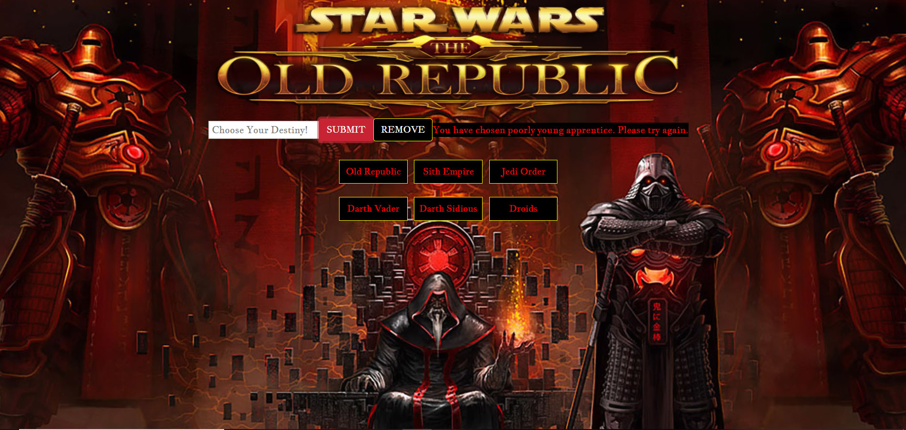

# Star Wars API
https://cjsummers003.github.io/Giphy-API

* The User will click on one of the Star Wars themed button to obtain a selection of gifs related to the button selected.

* Once the gifs are displayed, if the user click on the image it will animate and if clicked again the animation will stop.

* The User can also select their own gifs by entering a subject into the "Chose Your Destingy" area and click submit.
* The Users custom selection will be displayed.

* If the user leave the area blank and just hits the submit button a message will be displayed to alert the user to try again.

<h2><strong>External Resources Used</Strong></h2>
<ul>
  <li>Bootstrap</li>
  <li>JQuery</li>

<h2><strong>Author</strong></h2>
CJ Summers - HTML/CSS/JavaScript
